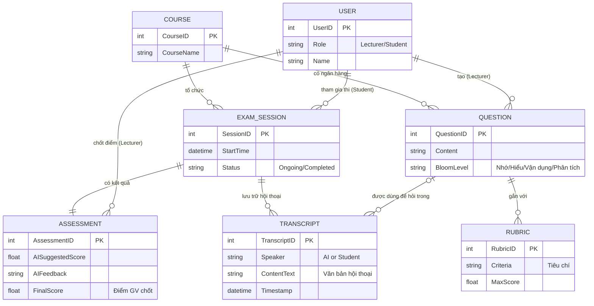

# Conceptual ERD

```mermaid
erDiagram
    USER {
        int UserID PK
        string Role "Lecturer/Student"
        string Name
    }
    COURSE {
        int CourseID PK
        string CourseName
    }
    QUESTION {
        int QuestionID PK
        string Content
        string BloomLevel "Nhớ/Hiểu/Vận dụng/Phân tích"
    }
    RUBRIC {
        int RubricID PK
        string Criteria "Tiêu chí"
        float MaxScore
    }
    EXAM_SESSION {
        int SessionID PK
        datetime StartTime
        string Status "Ongoing/Completed"
    }
    TRANSCRIPT {
        int TranscriptID PK
        string Speaker "AI or Student"
        string ContentText "Văn bản hội thoại"
        datetime Timestamp
    }
    ASSESSMENT {
        int AssessmentID PK
        float AISuggestedScore
        string AIFeedback
        float FinalScore "Điểm GV chốt"
    }

    USER ||--o{ EXAM_SESSION : "tham gia thi (Student)"
    USER ||--o{ ASSESSMENT : "chốt điểm (Lecturer)"
    USER ||--o{ QUESTION : "tạo (Lecturer)"
    
    COURSE ||--o{ QUESTION : "có ngân hàng"
    COURSE ||--o{ EXAM_SESSION : "tổ chức"

    QUESTION ||--o{ RUBRIC : "gắn với"
    QUESTION |o--o{ TRANSCRIPT : "được dùng để hỏi trong"

    EXAM_SESSION ||--o{ TRANSCRIPT : "lưu trữ hội thoại"
    EXAM_SESSION ||--|| ASSESSMENT : "có kết quả"
```
